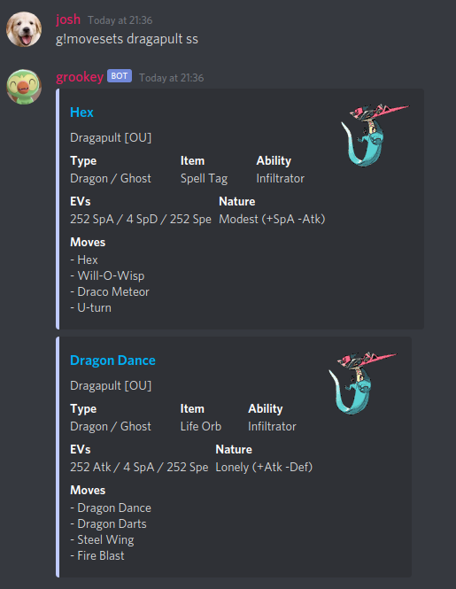

# grookey

A discord bot for competitive Pokémon battling related things, plus some other nifty features. This is a hobby project.

## Is grookey right for me?

The primary selling point of grookey is that it can retrieve data from Smogon and send it back in a pretty format within discord. Want to know Dragapult's competitive movesets in Sword and Shield? No problem:



## What other alternatives are there?

The bot which has the most similar functionality to grookey is [SableyeBot3](https://github.com/JsKingBoo/SableyeBot3) which you may also want to consider using. The difference between grookey and SableyeBot is that grookey hooks directly into Smogon's web interface, whereas SableyeBot uses the databases provided in Pokémon Showdown to retrieve information.

## Installing for self-hosting

To install you need Docker and Docker Compose. You also need to get your bot token from the Discord dashboard and copy/paste it into a `.env` file located in the **root directory of this repo**, where the variable is named `TOKEN`.

Then all you need to do is open a terminal, navigate to this folder and run:

```bash
sudo docker-compose up -d
```

If you're on Windows, open a PowerShell or `cmd` window as an administrator and run:

```batch
docker-compose up -d
```

Assuming you haven't deployed these containers before, the images are also built by default. The containers are all built from the `docker-compose.yml` files and their respective `Dockerfile`s.

## How it works

Different features that require certain functionality are moved to different containers. For example, Smogon data is retrieved through a headless browser whcih runs in a Node container. To communicate between containers, the Bot container (containing the code which interacts with Discord) will fire off requests to the container's DNS and a port using Python's `requests` library and awaits the result. The result can be something like data coming back from the container or a code to say that the command completed successfully. The bot container then sends the response in Discord as normal.

For Node containers, the `express` package from `npm` is used to handle the incoming requests.

## Containers

### Bot

Based on Python 3.8, this container runs the code which interacts with Discord.

### Smogon

*TLDR: Smogon data is retrieved by using a headless browser to hook into the DOM of the relevant page and sending back everything needed.*

This is a Node-based API which uses Express to route requests sent from the bot to retrieve Smogon moveset information about specific Pokémon in a specific metagame.

To get the Smogon data, Zombie is used as a headless browser. The URL is built from the commands given through Discord, and the page is 'rendered' using Zombie. Then, specific DOM queries are made to extract moveset titles, movesets, and the tier of the Pokémon. This data is returned to the bot along with a code indicating success/fail.

This kind of manipulation isn't perfect and can cause the bot to crash for specific Pokémon but it works most of the time. Even Gen I & II where abilities/held items didn't exist return okay.

If the response succeeds, the bot sends the moveset information, the titles of the movesets, and the type of the Pokémon in separate fields in an object. The moveset information and the titles correspond with each other, so the first title in the title array is the title for the first moveset in the moveset array, and so on. This means that you can `zip` them together if you need to.

The response sent by the Bot is an embed containing the key moveset information: ability, nature, EVs, held item and moves.

*I'm planning to switch from Zombie to Puppeteer eventually (a headless browser which is still being actively maintained), unless I can find somewhere detailing the (new) Smogon API endpoints, if they even exist publicly. Even then, the entire Smogon interface would require a heavy overhaul.*

## Disclaimer

I'm not affiliated with Smogon.
